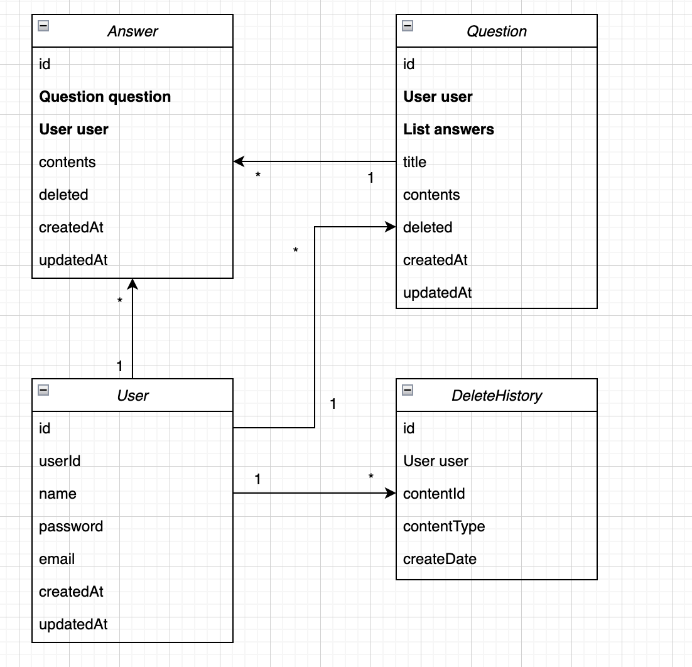

# 🚀 1단계 - 엔티티 매핑

## 요구 사항

QnA 서비스를 만들어가면서 JPA로 실제 도메인 모델을 어떻게 구성하고 객체와 테이블을 어떻게 매핑해야 하는지 알아본다.

- 아래의 DDL(Data Definition Language)을 보고 유추하여 엔티티 클래스와 리포지토리 클래스를 작성해 본다.
- @DataJpaTest를 사용하여 학습 테스트를 해 본다.

```sql
create table answer
(
    id          bigint generated by default as identity,
    contents    clob,
    created_at  timestamp not null,
    deleted     boolean   not null,
    question_id bigint,
    updated_at  timestamp,
    writer_id   bigint,
    primary key (id)
)
```

```sql
create table delete_history
(
    id            bigint generated by default as identity,
    content_id    bigint,
    content_type  varchar(255),
    create_date   timestamp,
    deleted_by_id bigint,
    primary key (id)
)
```

```sql
create table question
(
    id         bigint generated by default as identity,
    contents   clob,
    created_at timestamp    not null,
    deleted    boolean      not null,
    title      varchar(100) not null,
    updated_at timestamp,
    writer_id  bigint,
    primary key (id)
)
```

```sql
create table user
(
    id         bigint generated by default as identity,
    created_at timestamp   not null,
    email      varchar(50),
    name       varchar(20) not null,
    password   varchar(20) not null,
    updated_at timestamp,
    user_id    varchar(20) not null,
    primary key (id)
)

alter table user
    add constraint UK_a3imlf41l37utmxiquukk8ajc unique (user_id)
```

### 📚 TODO LIST 📚

- **공통 엔티티 분리**
  - [x] createdAt, updatedAt을 가지고 있는 Entity 작성
- **answer 테이블**
  - [x] Entity 매핑
    - id : GenerateType.IDENTITY
    - created_by : NOT NULL
    - deleted : NOT NULL
  - [x] `@DataJpaTest` 사용하여 테스트 코드 작성
- **delete_history 테이블**
  - [x] Entity 매핑
    - id : GenerateType.IDENTITY
  - [x] `@DataJpaTest` 사용하여 테스트 코드 작성
- **question 테이블**
  - [x] Entity 매핑
    - id : GenerateType.IDENTITY
    - created_by : NOT NULL
    - deleted : NOT NULL
    - title : NOT NULL
  - [x] `@DataJpaTest` 사용하여 테스트 코드 작성
- **user 테이블**
  - [x] Entity 매핑
    - id : GenerateType.IDENTITY
    - name : NOT NULL
    - password : NOT NULL
    - user_id : NOT NULL, UNIQUE
  - [x] `@DataJpaTest` 사용하여 테스트 코드 작성

---

# 🚀 2단계 - 연관 관계 매핑

## 요구사항

QnA 서비스를 만들어가면서 JPA로 실제 도메인 모델을 어떻게 구성하고 객체와 테이블을 어떻게 매핑해야 하는지 알아본다.

- 객체의 참조와 테이블의 외래 키를 매핑해서 객체에서는 참조를 사용하고 테이블에서는 외래 키를 사용할 수 있도록 한다.

## 힌트

```sql
alter table answer
    add constraint fk_answer_to_question
        foreign key (question_id)
            references question

alter table answer
    add constraint fk_answer_writer
        foreign key (writer_id)
            references user

alter table delete_history
    add constraint fk_delete_history_to_user
        foreign key (deleted_by_id)
            references user

alter table question
    add constraint fk_question_writer
        foreign key (writer_id)
            references user
```

### 📚 TODO LIST 📚

- 객체와 테이블 매핑 관계
  - [x] 객체, 테이블 매핑 관계 구조 파악
    - 객체 관계 구조
      
    - 테이블 관계 구조
      
- **answer 테이블**
  - [x] Entity 수정
  - [x] 테스트 코드 추가
- **delete_history 테이블**
  - [x] Entity 수정
  - [x] 테스트 코드 추가
- **question 테이블**
  - [x] Entity 수정
  - [x] 테스트 코드 추가
- **user 테이블**
  - [x] Entity 수정
  - [x] ~~테스트 코드 추가~~

---

# 🚀 3단계 - 질문 삭제하기 리팩터링

## 요구사항
QnA 서비스를 만들어가면서 JPA로 실제 도메인 모델을 어떻게 구성하고 객체와 테이블을 어떻게 매핑해야 하는지 알아본다.
- 질문 데이터를 완전히 삭제하는 것이 아니라 데이터의 상태를 삭제 상태(deleted - boolean type)로 변경한다.
- 로그인 사용자와 질문한 사람이 같은 경우 삭제할 수 있다.
- 답변이 없는 경우 삭제가 가능하다.
- 질문자와 답변 글의 모든 답변자 같은 경우 삭제가 가능하다.
- 질문을 삭제할 때 답변 또한 삭제해야 하며, 답변의 삭제 또한 삭제 상태(deleted)를 변경한다.
- 질문자와 답변자가 다른 경우 답변을 삭제할 수 없다.
- 질문과 답변 삭제 이력에 대한 정보를 DeleteHistory를 활용해 남긴다.

## 프로그래밍 요구 사항
- `qna.service.QnaService`의 `deleteQuestion()`는 앞의 질문 삭제 기능을 구현한 코드이다. 이 메서드는 단위 테스트하기 어려운 코드와 단위 테스트 가능한 코드가 섞여 있다.
- 단위 테스트하기 어려운 코드와 단위 테스트 가능한 코드를 분리해 단위 테스트 가능한 코드에 대해 단위 테스트를 구현한다.
- 리팩터링을 완료한 후에도 `src/test/java` 디렉터리의 `qna.service.QnaServiceTest`의 모든 테스트가 통과해야 한다.

```java
@Transactional
public void deleteQuestion(User loginUser, Long questionId) throws CannotDeleteException {
    Question question = findQuestionById(questionId);
    if (!question.isOwner(loginUser)) {
        throw new CannotDeleteException("질문을 삭제할 권한이 없습니다.");
    }

    List<Answer> answers = question.getAnswers();
    for (Answer answer : answers) {
        if (!answer.isOwner(loginUser)) {
            throw new CannotDeleteException("다른 사람이 쓴 답변이 있어 삭제할 수 없습니다.");
        }
    }

    List<DeleteHistory> deleteHistories = new ArrayList<>();
    question.setDeleted(true);
    deleteHistories.add(new DeleteHistory(ContentType.QUESTION, questionId, question.getWriterId(), LocalDateTime.now()));
    for (Answer answer : answers) {
        answer.setDeleted(true);
        deleteHistories.add(new DeleteHistory(ContentType.ANSWER, answer.getId(), answer.getWriterId(), LocalDateTime.now()));
    }
    deleteHistoryService.saveAll(deleteHistories);
}
```

- 자바 코드 컨벤션을 지키면서 프로그래밍한다.
  - 기본적으로 Google Java Style Guide을 원칙으로 한다.
  - 단, 들여쓰기는 '2 spaces'가 아닌 '4 spaces'로 한다.
- indent(인덴트, 들여쓰기) depth를 2를 넘지 않도록 구현한다. 1까지만 허용한다.
  - 예를 들어 while문 안에 if문이 있으면 들여쓰기는 2이다.
  - 힌트: indent(인덴트, 들여쓰기) depth를 줄이는 좋은 방법은 함수(또는 메서드)를 분리하면 된다.
- 3항 연산자를 쓰지 않는다.
- else 예약어를 쓰지 않는다.
  - else 예약어를 쓰지 말라고 하니 switch/case로 구현하는 경우가 있는데 switch/case도 허용하지 않는다.
  - 힌트: if문에서 값을 반환하는 방식으로 구현하면 else 예약어를 사용하지 않아도 된다.
- 모든 기능을 TDD로 구현해 단위 테스트가 존재해야 한다. 단, UI(System.out, System.in) 로직은 제외
  - 핵심 로직을 구현하는 코드와 UI를 담당하는 로직을 구분한다.
  - UI 로직을 InputView, ResultView와 같은 클래스를 추가해 분리한다.
- 함수(또는 메서드)의 길이가 10라인을 넘어가지 않도록 구현한다.
  - 함수(또는 메소드)가 한 가지 일만 하도록 최대한 작게 만들어라.
- 배열 대신 컬렉션을 사용한다.
- 모든 원시 값과 문자열을 포장한다
- 줄여 쓰지 않는다(축약 금지).
- 일급 컬렉션을 쓴다.
- 모든 엔티티를 작게 유지한다.
- 3개 이상의 인스턴스 변수를 가진 클래스를 쓰지 않는다.


### 📚 TODO LIST 📚
- 객체 관계 구조 수정
  - [x] 객체 관계 구조 개선
    
- 질문 삭제하기 리팩토링
  - [x] 서비스 레이어링 리팩토링
  - [x] 불필요한 메소드 정리
- STEP2 리뷰 확인
  - [ ] 리뷰 사항 반영
---
